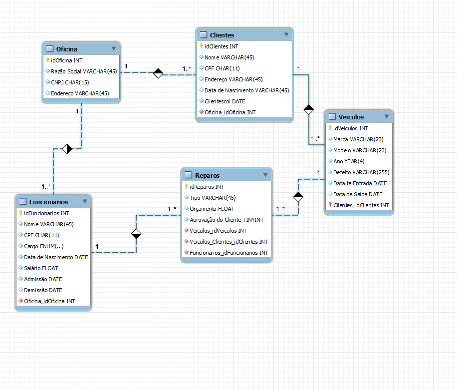

# Desafio Oficina

Desafio DIO com MYSQL

### 
 Antonio Victor Pereira Severiano

- Recuperações simples com SELECT Statement
- Filtros com WHERE Statement
- Crie expressões para gerar atributos derivados
- Defina ordenações dos dados com ORDER BY
- Condições de filtros aos grupos – HAVING Statement
- Crie junções entre tabelas para fornecer uma perspectiva mais complexa dos dados

## Diagrama EER Oficina

## Tabelas

* Oficina
* Clientes
* Funcionarios
* Veiculos
* Reparos

## Comandos que são bem utilizados

* use oficina
* show tables

## Algumas Funções de Pesquisa.

### Selecionar Todos os Clientes que são de maceió.

* select idCliente, Nome, CPF, Endereco, DataDeNascimento from clientes
where Endereco like '%Maceió%'
order by Nome;

### Selecionar Todos os funcionários que foram demitidos.

* select idFuncionario, Nome, CPF, Cargo, Salario, Admissão, Demissao  from funcionarios
where Demissao is not null;

### Selecionar Todos os funcionários que foram demitidos e mostrar suas contas rescisórias e ordenar por nome.

* select idFuncionario, Nome, CPF, Cargo, Salario, Admissão, Demissao, round(Salario*5.5,2) Acordo_trabalhista,
case 
when year(demissao) > 2021 then round( (Salario*5.5) + (salario*2.15),2)
when year(demissao) > 2020 then round( (Salario*5.5) + (salario*1.7),2)
when year(demissao) > 2019 then round( (Salario*5.5) + (salario*1.45),2)
when year(demissao) > 2018 then round( (Salario*5.5) + (salario*1.25),2)
else salario*1.1
end Rescisão
from funcionarios
where Demissao is not null
order by nome;

### Selecionar todos os veiculos que ano maior ou igual a 2014.

* select idVeiculo, Marca, Modelo, Ano from veiculos
where Ano >= 2014;

### Selecionar todos os veiculos que ano entre 2017 a 2022.

* select idVeiculo, Marca, Modelo, Ano 
from veiculos
where ( Ano between 2017 and 2022 );

### Selecionar quantidade de veiculos por marca e ordenar pela maior quantidade.
 
* SELECT Marca, COUNT(idVeiculo) AS QuantidadeDeVeiculos
FROM veiculos
GROUP BY Marca
order by COUNT(idVeiculo) desc;

### Selecionar funcionários que estão no cargo de mecanico e não foram demitidos.

* SELECT idfuncionario, nome, demissao 
FROM funcionarios 
WHERE cargo = 'mecanico' AND demissao IS NULL
order by nome;

### Selecionar a junção das tabelas.

* SELECT *
FROM reparos
INNER JOIN clientes
ON reparos.IdCliente = clientes.idCliente
inner join funcionarios 
on reparos.idFuncionario = funcionarios.idFuncionario
inner join veiculos
on reparos.idVeiculo = veiculos.idVeiculo;

### Selecionar a junção das tabelas e mostrar somente dados que seja interessantes + bônus de 3% sobre o orçamento para o funcionário e ordenar pelo nome do cliente.

* SELECT reparos.idReparo iD_Reparo, clientes.Nome Nome_Cliente, clientes.CPF CPF_Cliente, 
veiculos.Marca, veiculos.Modelo, veiculos.Defeito Defeito_do_Veiculo, 
funcionarios.Nome Nome_do_Funcionário, funcionarios.CPF CPF_do_Funcionário ,round(reparos.Orcamento*0.03,2) Bônus_pelo_serviço_para_o_funcionário, 
reparos.Orcamento Orçamento
FROM reparos
INNER JOIN clientes
ON reparos.IdCliente = clientes.idCliente
inner join funcionarios 
on reparos.idFuncionario = funcionarios.idFuncionario
inner join veiculos
on reparos.idVeiculo = veiculos.idVeiculo
where AprovacaoDoCliente is true
order by clientes.Nome;

## 
 Conecte-se comigo

     
  
  
  
